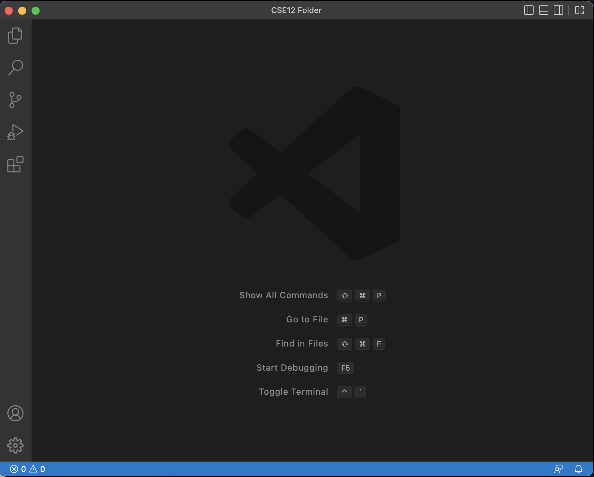
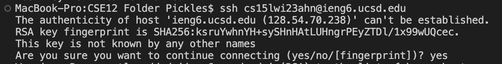
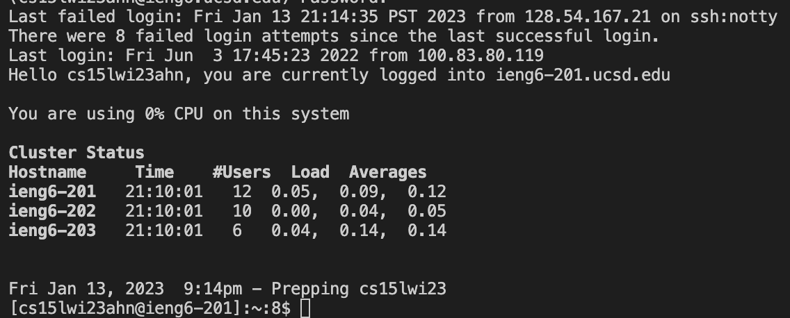
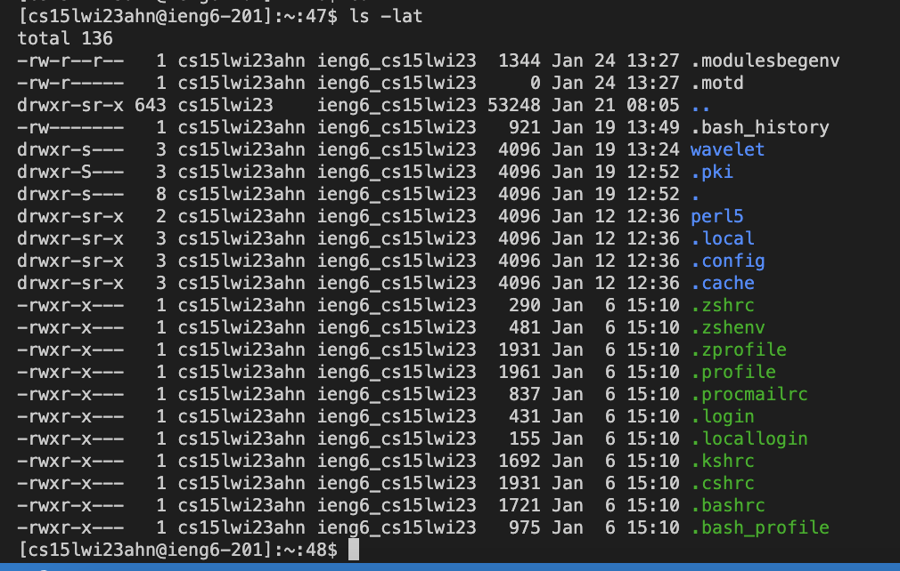
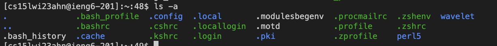

# Week 1 - Getting Started 

Let's get started on how to log into your course-specific account on **ieng6**

## Installing VScode

* Go to the Visual Studio Code website: [VSCode](https://code.visualstudio.com/)
* Follow the instructions on the page - download the correct OS file depending on your device OS
* When installed and opened, the page should look something like this: 

## Remotely Connecting 

We are going to connect our terminal to a computer in the CSE basement. 

* First we need to install [git](https://git-scm.com/downloads)on our device
* Once installed, we must set our default terminal to use the git bash in VSCode. Here is a thread on how to do this: 
[gitbash-setup](https://stackoverflow.com/questions/42606837/how-do-i-use-bash-on-windows-from-the-visual-studio-code-integrated-terminal/50527994#50527994) 
* Now, to use the ssh command, open the terminal in VSCode by pressing `Cntrl/Cmd` & "`"
* Type in `ssh cs15lwi23zz@ieng6.ucsd.edu` but with the `zz` replaced with the letters of your course specific account 
* If you get the message below, type yes in the terminal followed with your account password. 

 

* Great! Now you're in. Your terminal should look something like this: 

 

## Trying Some Commands

To test, run some commands and implement them in different ways. Here are a list of commands you can use for this: 

* `cd ~`
* `cd`
* `ls -lat`
* `ls -a`
* `cp /home/linux/ieng6/cs15lwi23/public/hello.txt ~/`
* `cat /home/linux/ieng6/cs15lwi23/public/hello.txt`

Here is the ls -lat command. It sdljfsdjfk

 

Here is the ls -a command. It 

 

## Logging Off

If you're bored of testing commands and want to log off, simply press `Ctrl-D` or run the command `exit` in the terminal. 

**Congratulations! You now know how to log into your course specific account on *ieng6*!**
