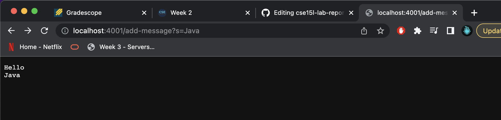
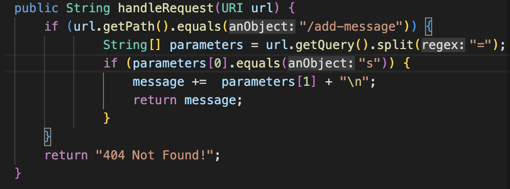
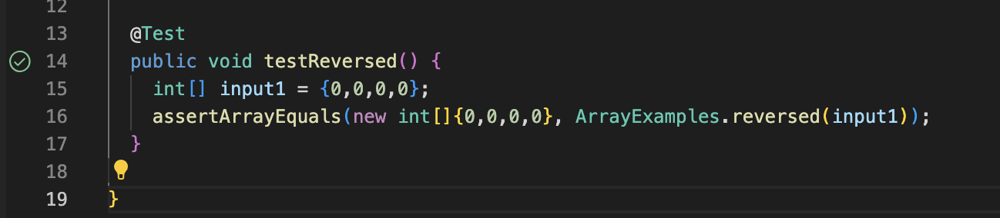

# Week 3 - Servers and Bugs 

## Part 1 

Here is a no argument screenshot: 


Only the `return "404 Not Found!";` segment runs as there is no argument passed in the query.

Here is a screenshot of the argument `/add-message?s=Hello` being passed 


This argument returns the message `Hello` on the page. Here is message `java` added to a new line. 



The part of the code segment that runs is the method `public String handleRequest(URI url)`. 

* The method first checks if the path contains the `/add-message` object. 
* If it does detect it, it splits the path at the `=` char after the query `?` and stores them into a a new string array `parameters`. 
* The two objects stored in the array are `s` and the string message you want to display on the website
* Then the method checks if the first value of the `parameters` array equals the `s` char
* If so, it adds the second value(the string message you want to display) and a new line to a string object that we return 
* If any of these conditionals return false, `404 Not Found` is returned. 



## Part 2

Here is a failure inducing input for the `reversed` function: 
```
@Test
public void testReversed() {
  int[] input = {1, 2, 3, 4};
  assertArrayEquals(new int[]{4, 3, 2, 1}, ArrayExamples.reversed(input));
}
```
The symptom for this input is here as followed: 

 

Here is a non-failure induced input for the `reversed` function. This code segment works since an unupdated array will just be an array of 0s : 

```
@Test
public void testReversed() {
  int[] input1 = {0,0,0,0};
  assertArrayEquals(new int[]{0,0,0,0}, ArrayExamples.reversed(input1));
}
```
Here is a screenshot of it passing the test: 



### Issue with the code

The original code did not update the new array or return it. From the failure-inducing output, we can see that we expected the first value to be 4,but the actual value returned was 0. This made us realize that the method was only returning a new array of 0's because each original value of `int[] arr` was being replaced by the 0 values of `int[] newArray`. We tested this with the non-failure induced input of an array of just 0's and it passed, which confirmed our findings. We changed the code so that it may work. 

Here is the original code: 
```
static int[] reversed(int[] arr) { 
  int[] newArray = new int[arr.length]; 
  for(int i =0; i < arr.length; i++) { 
    arr[i] = newArray[arr.length - i - 1];
  }
  return arr; 
}
```
Here is the updated code: 
```
static int[] reversed(int[] arr) { 
  int[] newArray = new int[arr.length]; 
  for(int i =0; i < arr.length; i++) { 
    newArray[arr.length - i - 1] = arr[i]; 
  }
  return newArray; 
}
```
## Part 3
I learned about what the difference was between bugs and symptoms was. A sympton is a behavior that you see from a faulty piece of code. A bug is that faulty piece of code that causes a symptom. 
