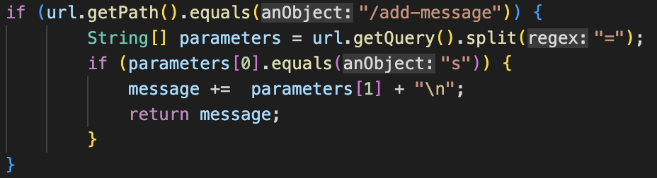
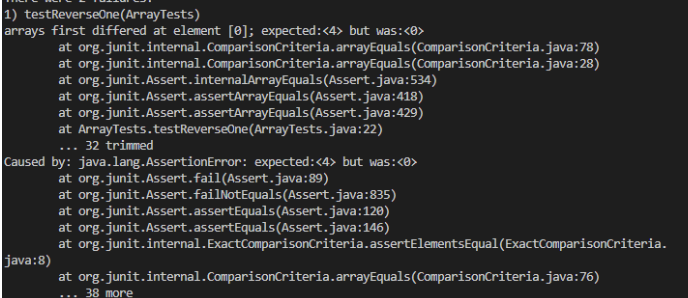

# Week 3 - Servers and Bugs 

## Part 1 

Here is a no argument screenshot: 


Only the `return "404 Not Found!";` segment runs as there is no argument passed in the query.

Here is a screenshot of the argument `/add-message?s=Hello` being passed 


This argument returns the message `Hello` on the page. The part of the code segment that runs is shown below: 



## Part 2

Here is a failure inducing input for the `reversed` function: 
```
@Test
public void testReversed() {
  int[] input = {1, 2, 3, 4};
  assertArrayEquals(new int[]{4, 3, 2, 1}, ArrayExamples.reversed(input));
}
```
The symptom for this input is here as followed: 

 

Here is a non-failure induced input for the `reversed` function. This code segment works since an unupdated array will just be an array of 0s : 

```
@Test
public void testReversed() {
  int[] input1 = {0,0,0,0};
  assertArrayEquals(new int[]{0,0,0,0}, ArrayExamples.reversed(input1));
}
```
### Issue with the code

The original code did not update the new array or return it. We changed the code so that it may work. 

Here is the original code: 
```
static int[] reversed(int[] arr) { 
  int[] newArray = new int[arr.length]; 
  for(int i =0; i < arr.length; i++) { 
    arr[i] = newArray[arr.length - i - 1];
  }
  return arr; 
}
```
Here is the updated code: 
```
static int[] reversed(int[] arr) { 
  int[] newArray = new int[arr.length]; 
  for(int i =0; i < arr.length; i++) { 
    newArray[arr.length - i - 1] = arr[i]; 
  }
  return newArray; 
}
```
