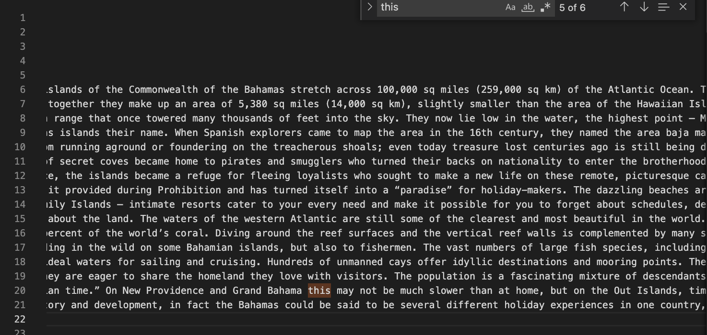

# Week 5 - Researching Commands

### *Alternate ways to use the command `grep`*

##### `grep -i "(txt)" (filename)`

Here is an example of the case sensitive grep command. `grep -i 'this' Bahamas-Intro.txt`

Under this command, only the lines with "this" (case sensitive) are printed out. In this case, the entirety of line 20 is printed out. The way I used this command, although it works isn't very useful to me because the sentences of this file aren't split by line. And since, other sentences that start with "This" are printed out as well because they are also on line 20. The grep -i is useful if you want to search for a text that is case sensitive in a file. If you would only like to retrieve the case sensitive word, make sure it is in its own line since this command prints out the entire line. 
