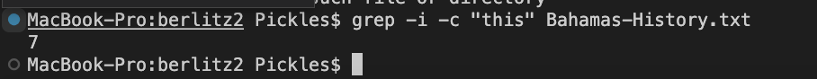

# Week 5 - Researching Commands

### *Alternate ways to use the command `grep`*

####  #1: `grep -i "(txt)" (filename)`

Here is an example of the case insensitive grep command. `grep -i "this" Bahamas-Intro.txt`

Under this command, all the lines with "this" (case insensitive) are printed out. In this case, the entirety of lines 6,7,17,19,20 are printed out. The way I used this command, although it works, isn't very useful to me because the sentences of this file aren't split by line. Individual sentences aren't being returned, rather the entire code line is. The grep -i is useful if you want to search for a text that is case insensitive in a file. If you would only like to retrieve the case sensitive word, make sure it is in its own line since this command prints out the entire line. 

Here is another example of the case senstive grep command. `grep -i "ch4.txt" find-results.txt`

In this case, both files `ch4.txt` and `CH4.txt` are printed out because grep-i is case insensitive. This is particularly useful when you want to find files or texts in which you do not care if there are caps. In this case, I wanted to return all files that had the name "ch4" no matter the case. 

####  #2:`grep -c "(txt)" (filename)`

This command returns how many times a certain word appears in a file. It is useful because it can let me know how many times a word appears in a text file. Here is an example: `grep -c "this" Bahamas-Intro.txt`

Here is the amount of times "this" appears(case insensitive)

Alternateively, I can figure out how many text files there are in a certain directory by saving all file names in a text file and then using this command to count the amount of files that contain the ".txt" string.

