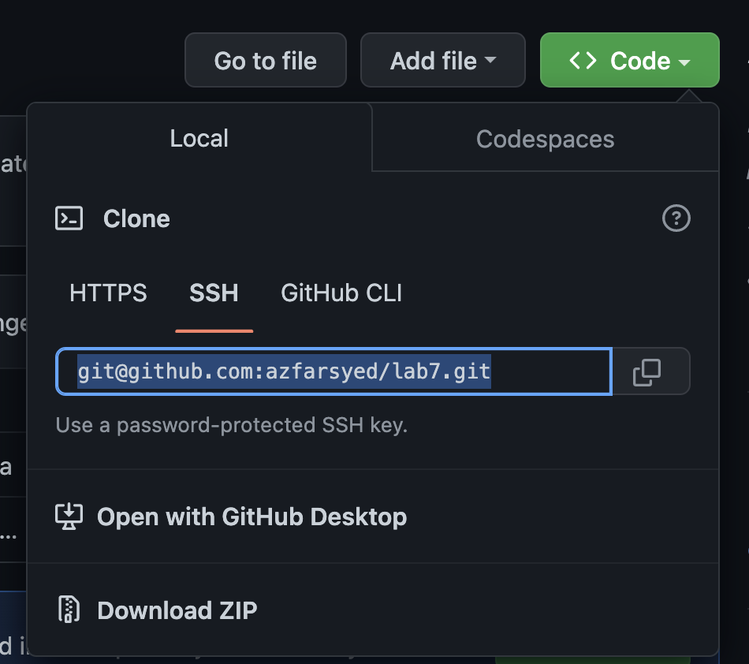
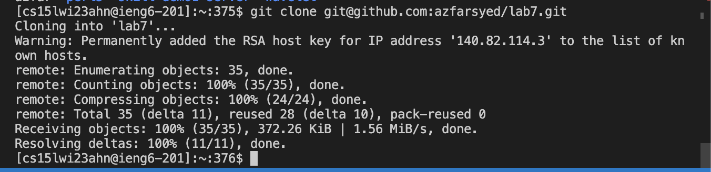
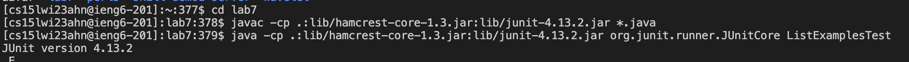
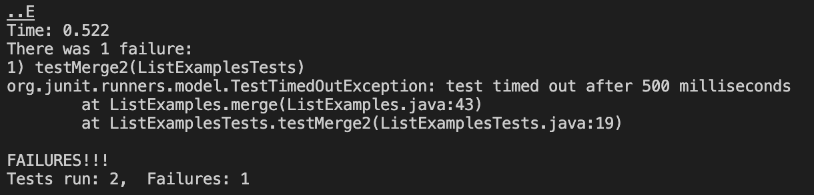
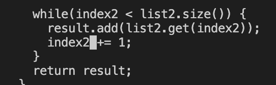
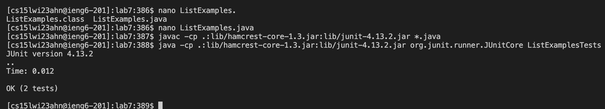
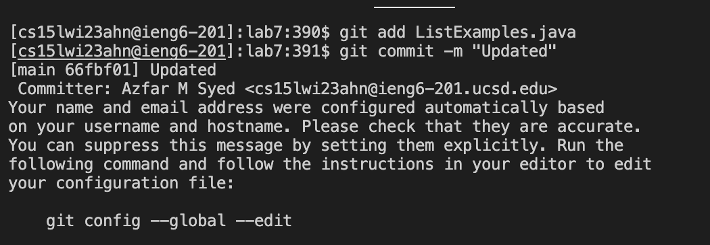
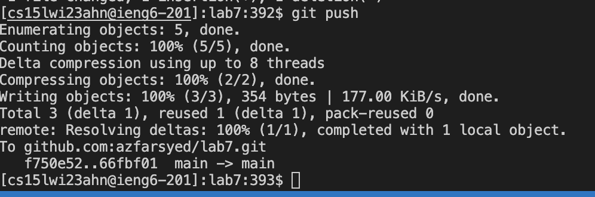

# Week 7 - Friendly Competition 

### 1) Fork the lab7 repository 

### 2) Log into ieng6

### 3) Clone your fork of the repository from your github account

- Click the `Code` dropdown 
- Click "SSH" and copy the link as shown 

- type `git clone` + the link that you copied

### 4) Run the tests for `ListExamplesTest` and demonstrate that they fail 

- Run the test commands: 
  - I copied these commands from the week 3 website 
  - `javac -cp .:lib/hamcrest-core-1.3.jar:lib/junit-4.13.2.jar *.java` 
  - `java -cp .:lib/hamcrest-core-1.3.jar:lib/junit-4.13.2.jar org.junit.runner.JUnitCore ListExamplesTest`
 

### 5) Edit The code file to fix the failing text

- type `nano L<tab>.j<tab>` to access the file `ListExamples`
- To get the error on line 42:
  - I scrolled all the way down using the trackpad 
  - Then pressed "up" 7 times
  - Then change "index1" to "index2" 
  

To exit and save, press `^O` then `^X`
  
### 6) Show that the tests work 
- to compile the tester again I pressed "up" 4 times
- to run the tester I pressed "up" 4 times again 

### 7) Commit and push the resulting change to your Github account

- type `git add ListExamples.java`
- type `git commit -m "Updated"`
- type `git push`

  
   
