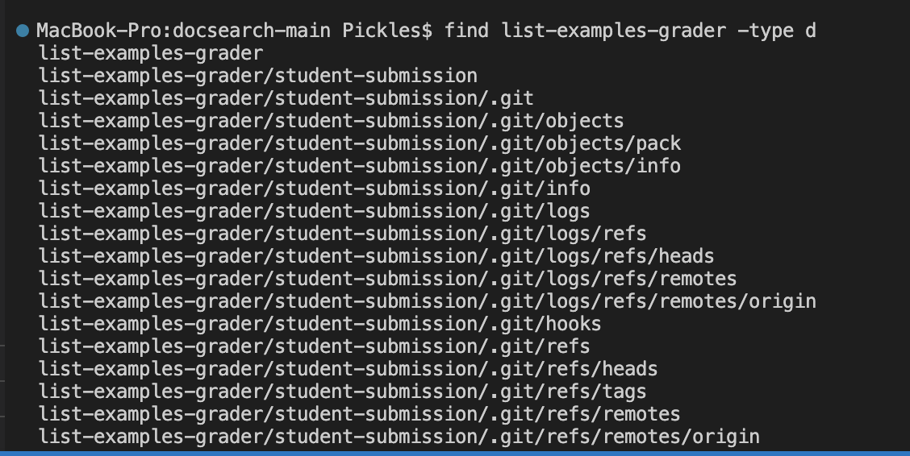

# Week 9 - Researching Commands RELOADED

### *Alternate ways to use the command `find`*

####  #1: `find (dir) -size (+,-)(specified size)`

This command finds all the files under or over a specified size in a directory. This is useful so that I can filter out files that are taking too much space in directory. Or if I do not know the name of a file, but I know that it is very big/small, I can use that information to find the file I need. 

Here is an example using the less than feature(-(size)): `find travel_guides/berlitz1 -size -2k`

In this case, the command prints out all the files in the berlitz1 folder that are less than 2 kilobytes of data. 

Here is an example using the greater than feature(+ size): `find travel_guides/berlitz1 -size +2k`

In this case, the command prints out all the files in the berlitz1 folder that are greater than 2 kilobytes of data(There are many more files in this command output that I just did not include to save space). 

####  #2: `find (dir) -mtime (+,-)(specified time in days)`

This command finds all files that were modified under or over a specified amount of time in days. This is useful so that I can filter out files based on what date they were modified. For example, if I want to update all files that haven't been modified in the past 10 days, I can use this command to list those files so that I can modify them. 

Here is an exmaple using the less than feature(-(time)): `find berlitz1 -mtime -10` 

First, I modified the HistoryIndia.txt file using `nano HistoryIndia.txt` 

Then I called the find command: 

 

In this case, the command prints out the berlitz1 folder and History.txt file since both were updated when I used `nano`. Nothing else was modified in the last 10 days in this directory. 

Here is an exmaple using the more than feature(+(time)): `find berlitz1 -mtime +10`

 

In this case, the command prints out everything in the berlitz1 folder since they were all added and/or updated more than 10 days ago.

####  #3: `find (dir) -type (type)` 

This command finds all files in a path of a certain type. It is useful so that I can print different types of files that I need for different reasons. 

Here is an example of finding all directories in the list-examples-grader path: `find list-examples-grader -type d`

 

In this case, all directories in the list-examples-grader path is printed in the terminal since `-type d` prints out the directories in path. This is useful if I only wanted to see the directories that resided within the list-examples-grader path. 

Here is an example of finding all files in the OUP directory: find OUP -type f 

 

In this case, all the .txt files are outputted. None of the folders which contain the files are printed since they are not files, but rather folders. This is useful if I only wanted to see the .txt files that were present in the OUP directory. 

####  #4: `find (dir) -type f -empty`

This command finds all files which are empty. This is useful for decluttering. Using this, you can print out all files that are empty and then delete them

Here is an example of finding all files which are empty: `find written_2 -type f -empty`

 

In this case, I added 3 random empty files which were empty in the written2 folder. Using that command, I could locate these files. If I wanted to, I could delete these files using `rm -rf` 

Here is another example of finding all files which are empty in the OUP folder: `find non-fiction/OUP -type f -empty`

 

In this case, I deleted the contents of all files in the Abernathy folder except for ch15.txt for the sake of this example. I then used the `-empty` command to list out all the files in which's contents were deleted. This could particularly be useful in this example to fetch out the one file(ch15.txt) that wasn't emptied out and empty out that one aswell.  

The sites that I used to find these commands are: 
- https://linuxhostsupport.com/blog/how-to-search-files-on-the-linux-terminal/
- https://www.redhat.com/sysadmin/linux-find-command
